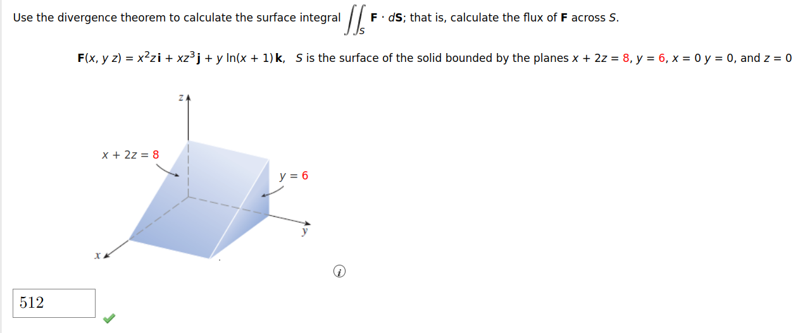

---

Here is the solution using \( z = \frac{8 - x}{2} \):

---

### Step 1: Set up the bounds
The solid is bounded by:
- \( z = 0 \) (bottom plane),
- \( z = \frac{8 - x}{2} \) (from \( x + 2z = 8 \)),
- \( x = 0 \) to \( x = 8 \),
- \( y = 0 \) to \( y = 6 \).

The volume integral becomes:
\[
\iiint_V 2xz \, dV = \int_{x=0}^{8} \int_{y=0}^{6} \int_{z=0}^{\frac{8-x}{2}} 2x z \, dz \, dy \, dx.
\]

---

### Step 2: Perform the inner integral (\( z \)):
\[
\int_{z=0}^{\frac{8-x}{2}} 2x z \, dz = 2x \int_{z=0}^{\frac{8-x}{2}} z \, dz = 2x \left[\frac{z^2}{2}\right]_0^{\frac{8-x}{2}}.
\]

Substitute the limits:
\[
2x \cdot \frac{\left(\frac{8-x}{2}\right)^2}{2} = 2x \cdot \frac{(8-x)^2}{8} = \frac{x (8-x)^2}{4}.
\]

---

### Step 3: Perform the middle integral (\( y \)):
The integrand does not depend on \( y \), so the \( y \)-integration simply multiplies by the length of \( y \)'s range:
\[
\int_{y=0}^{6} \frac{x (8-x)^2}{4} \, dy = 6 \cdot \frac{x (8-x)^2}{4}.
\]

Simplify:
\[
\frac{3x (8-x)^2}{2}.
\]

---

### Step 4: Perform the outer integral (\( x \)):
Now integrate with respect to \( x \):
\[
\int_{x=0}^{8} \frac{3x (8-x)^2}{2} \, dx = \frac{3}{2} \int_{x=0}^{8} x (8-x)^2 \, dx.
\]

Expand \((8-x)^2\):
\[
(8-x)^2 = 64 - 16x + x^2.
\]

Substitute this into the integral:
\[
\int_{x=0}^{8} x (8-x)^2 \, dx = \int_{x=0}^{8} x (64 - 16x + x^2) \, dx = \int_{x=0}^{8} (64x - 16x^2 + x^3) \, dx.
\]

Split into separate integrals:
\[
\int_{x=0}^{8} 64x \, dx - \int_{x=0}^{8} 16x^2 \, dx + \int_{x=0}^{8} x^3 \, dx.
\]

Compute each:
1. \(\int_{x=0}^{8} 64x \, dx = 64 \cdot \frac{x^2}{2} \Big|_0^8 = 64 \cdot \frac{64}{2} = 2048\),
2. \(\int_{x=0}^{8} 16x^2 \, dx = 16 \cdot \frac{x^3}{3} \Big|_0^8 = 16 \cdot \frac{512}{3} = \frac{8192}{3}\),
3. \(\int_{x=0}^{8} x^3 \, dx = \frac{x^4}{4} \Big|_0^8 = \frac{4096}{4} = 1024\).

Combine these:
\[
\int_{x=0}^{8} x (8-x)^2 \, dx = 2048 - \frac{8192}{3} + 1024 = \frac{1536}{3}.
\]

Now multiply by \(\frac{3}{2}\):
\[
\frac{3}{2} \cdot \frac{1536}{3} = 512.
\]

---

### Final Answer
The flux of \(\mathbf{F}\) across the surface \(S\) is:
\[
\boxed{512}.
\]