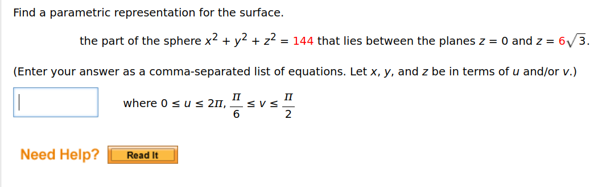

To solve this, we need to find a parametric representation for the specified portion of the sphere \( x^2 + y^2 + z^2 = 144 \), which is restricted to the planes \( z = 0 \) and \( z = 6\sqrt{3} \). The parametric equations of a sphere can be written in spherical coordinates:

\[
x = r \sin v \cos u, \quad y = r \sin v \sin u, \quad z = r \cos v
\]

### Step-by-step solution:

1. **Radius**:
   The equation of the sphere is \( x^2 + y^2 + z^2 = 144 \), so the radius \( r = \sqrt{144} = 12 \).

2. **Ranges for parameters**:
   - \( u \): The azimuthal angle, representing rotation around the \( z \)-axis, goes from \( 0 \) to \( 2\pi \).
   - \( v \): The polar angle, measured from the positive \( z \)-axis, is restricted by the planes:
     - At \( z = 6\sqrt{3} \), we solve \( z = r\cos v \):
       \[
       6\sqrt{3} = 12 \cos v \quad \Rightarrow \quad \cos v = \frac{\sqrt{3}}{2} \quad \Rightarrow \quad v = \frac{\pi}{6}.
       \]
     - At \( z = 0 \), we solve \( z = r\cos v \):
       \[
       0 = 12 \cos v \quad \Rightarrow \quad v = \frac{\pi}{2}.
       \]
     Hence, \( v \) ranges from \( \frac{\pi}{6} \) to \( \frac{\pi}{2} \).

3. **Parametric equations**:
   Substituting \( r = 12 \), the parametric representation is:
   \[
   x(u, v) = 12 \sin v \cos u, \quad y(u, v) = 12 \sin v \sin u, \quad z(u, v) = 12 \cos v,
   \]
   where \( 0 \leq u \leq 2\pi \) and \( \frac{\pi}{6} \leq v \leq \frac{\pi}{2} \).

### Final Answer:
\[
x = 12 \sin v \cos u, \, y = 12 \sin v \sin u, \, z = 12 \cos v
\]
where \( 0 \leq u \leq 2\pi \) and \( \frac{\pi}{6} \leq v \leq \frac{\pi}{2} \).

