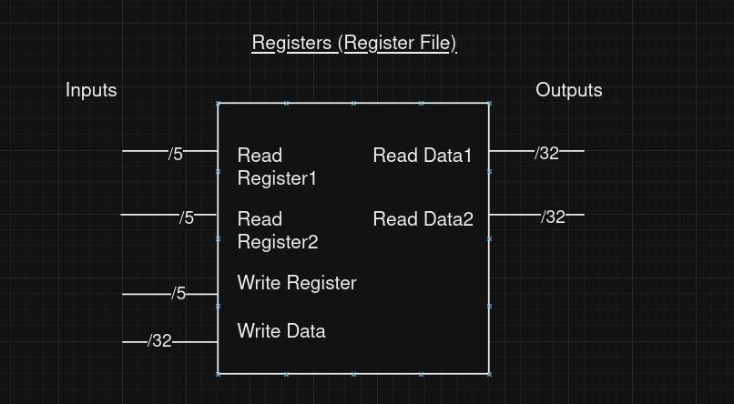
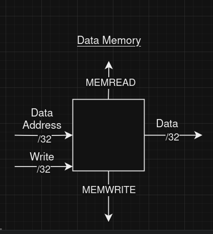
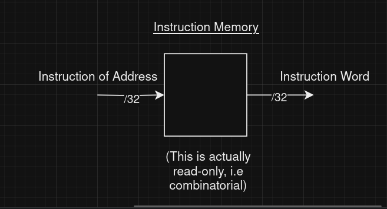

## Implementing the MIPS Instruction Set

- The hardware we are using is built from gates.
- Each of these gates is created from transistors.
- Computer processors contain billions of transistors.
- Even gates are considered too low-level, so we will design hardware at the block level.

```
transistors -> gates -> [ block diagrams ]
```

## Types of Components

We can break the components down into essentially two types:

1. **Sequential Circuits**
   - Synchronized by a clock (generally).
   - Outputs are a function of the current input and the current state (the circuit has memory).
   - **Example**: Registers. Registers are made of flip-flops. Each flip-flop receives a clock signal from the clock pulse generator.
   - **Flip-Flops**: Can be rising-edge triggered or falling-edge triggered. That is, at these events in the clock cycle signal, the flip-flop can receive updates. In our design, we need to choose only one of these.

2. **Combinatorial Circuits**
   - Functions of only current inputs.
   - No clock synchronization.

### Timing Model

We need to simplify our timing model for our purposes. In the real world, timing models are more complicated.

In our timing model, we simply **assume that a circuit computation is completed after some fixed amount of latency**.

For example, let's suppose we have an AND gate.

We will say that when `AND(a, b) = c`, `c` is updated after some latency.

#### Why?

This is because we want to measure time for our average clock cycle. Thus, if we make an assumption about how long the latency is for the timing model, we can make estimations of how long each clock cycle takes.

Each instruction will be associated with some use of hardware. If we know the hardware contains delays, we can measure how long it takes that hardware to perform certain computations.

## Drawing Components

### Register (also called Register File)

- We specify which register we want to read by passing some value to **Read Register1**. The output of **Read Data1** is the value we just read.
- From our diagram, we can see that each register has two outputs.
- The value we pass to **Write Register** specifies the address of the register that we want to write to. The value passed to **Write Data** specifies what data we want to write into that register.
- We don't need to synchronize reads with the clock; thus, reading register values is treated as a combinatorial circuit.
- Writing register values *is* synchronized with a clock, however, since this is a sequential circuit.



### Data Memory

- **MEMWRITE** and **MEMREAD** are signals that determine whether to write or read.
- Reading requires no clock synchronization. It is implied (though not pictured in the diagram) that writing requires clock signals.
- Theoretically, both **MEMWRITE** and **MEMREAD** lines can be 1 at the same time. However, due to the clock signal connected to **MEMWRITE**, there is no conflict between the two operations.



### Instruction Memory

- This is essentially a ROM.
- We pass an address to it, and the output is the instruction located at that address.



### Other Types We'll Be Using

- Adders, OR and AND blocks.

#### Arithmetic Logic Unit (ALU)

- Appendix B of the book contains an implementation of the ALU using gates. However, this is very low-level and not something we need to know for this course.
- The ALU hardware we study has a 4-bit control input. This input determines what operation the ALU performs (like add, subtract, etc.).
- The other two inputs are 32 bits each, A and B. A is the first operand, and B is the second operand.
- The output is 32 bits.
- **Example**: We pass `0001` to the ALU control input. This makes the ALU perform an OR operation. We pass two operands, A and B, to the ALU. The output, C, is the bitwise OR of A and B.

### Multiplexer (MUX)

- For more information, review the multiplexer in the textbook or an old computer organization textbook.