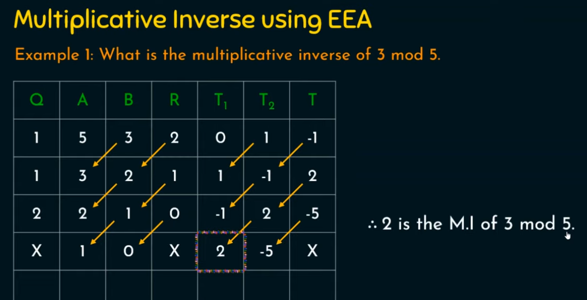

## References

### Numbered Alphabet

| Number | Letter |
|--------|--------|
| 0      | A      |
| 1      | B      |
| 2      | C      |
| 3      | D      |
| 4      | E      |
| 5      | F      |
| 6      | G      |
| 7      | H      |
| 8      | I      |
| 9      | J      |
| 10     | K      |
| 11     | L      |
| 12     | M      |
| 13     | N      |
| 14     | O      |
| 15     | P      |
| 16     | Q      |
| 17     | R      |
| 18     | S      |
| 19     | T      |
| 20     | U      |
| 21     | V      |
| 22     | W      |
| 23     | X      |
| 24     | Y      |
| 25     | Z      |

### Multiplicative Inverse (Extended Euclid's Algorithm)

1. \( Q \) is the integer quotient (round downwards) of \( A/B \).
2. \( R \) is the remainder of \( A/B \), or \( A \% B \).
3. Initially, \( T_{1} \) is 0 and \( T_{2} \) is 1.
4. \( T = T_{1} - T_{2} \cdot Q \).
5. Arrows indicating shifting. Use those values in the next row.
6. Repeat this process until we encounter a situation that can't be computed, such as \( A/B = 1/0 \Rightarrow \text{undefined} \).

## Affine Cipher

### Encryption

The encryption function is defined as:

\[
f(x) = ax + b
\]

where:
- \( 1 \leq a \leq 25 \)
- \( 0 \leq b \leq 25 \)

To encrypt the character **"g"**, follow these steps:

1. Notice that **"g"** is the 6th letter in the alphabet (considering \( a=0 \)).
2. Apply the function to "g":
   \[
   f(6) = 7(6) + 2 = 44
   \]
3. Since \( 44 \geq 26 \), compute \( 44 \mod 26 = 18 \).  
   *(Note: If the result is not small enough, take the modulus again.)*
4. Finally, find the letter corresponding to \( 18 \), which is **"S"**.

Thus, **g → S** using the Affine Cipher.

### Decryption

#### Assumption: Key is known (Quiz 1)

Starting with the encryption equation:

\[
y = ax + b
\]

To solve for \( x \):

\[
x = a^{-1}(y - b)
\]

Thus, the formula for the plaintext character is:

\[
x = a^{-1}(y - b) \mod 26
\]

---

#### Example: Decrypting Ciphertext "WBQ" with Key "9x + 3"

Let:
- \( a = 9 \)
- \( b = 3 \)

Using the numbered alphabet table:
- "W" corresponds to \( 22 \)
- "B" corresponds to \( 3 \)
- "Q" corresponds to \( 16 \)

Follow the decryption process:

1. Start with "W" and substitute into the formula for \( x \):
   \[
   x = 9^{-1}(22 - 3) \mod 26 \\
   x = 9^{-1}(19) \mod 26
   \]

2. Before continuing, find the multiplicative inverse of \( 9 \) modulo \( 26 \). This requires solving \( 9^{-1} \mod 26 \) using the **Extended Euclidean Algorithm**.

---

#### Finding \( 9^{-1} \mod 26 \) Using Extended Euclidean Algorithm

1. Perform the Euclidean Algorithm to calculate \( \gcd(9, 26) \):
   \[
   26 = 9 \cdot 2 + 8
   \]
   \[
   9 = 8 \cdot 1 + 1
   \]
   \[
   8 = 1 \cdot 8 + 0
   \]

   Since \( \gcd(9, 26) = 1 \), the inverse exists.

2. Work backward to express \( 1 \) as a linear combination of \( 9 \) and \( 26 \):
   From \( 9 = 8 \cdot 1 + 1 \), rewrite:
   \[
   1 = 9 - 8
   \]
   Substitute \( 8 = 26 - 9 \cdot 2 \) into the equation:
   \[
   1 = 9 - (26 - 9 \cdot 2)
   \]
   Simplify:
   \[
   1 = 9 \cdot 3 - 26
   \]

3. Thus:
   \[
   9^{-1} \equiv 3 \mod 26
   \]

---

#### Continue Decrypting "W":

Substitute \( 9^{-1} = 3 \) into the equation:
\[
x = 3(19) \mod 26
\]
Simplify:
\[
x = 57 \mod 26 = 5
\]

The letter corresponding to \( 5 \) is **"F"**.