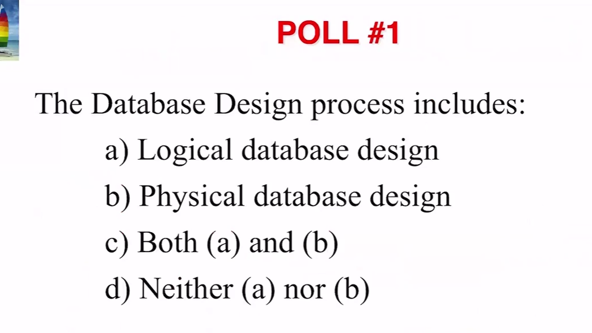

## Topic 1 Polls




# Lecture 1

###### Topic 1: Basic Concepts of a Database Management System

---

## What is a database?

Databases have the following properties:

- Repository of interrelated data.
- Efficient environment for fast queries with minimal resource usage.
- Accessible via application programs for data access and modification.

## Why don't we just use file systems to store all of the data?

### Design Principles

- **Redundancy, Inconsistency**  
  Multiple file formats often lead to duplicated information without built-in constraints. Implementing these constraints must be done manually in applications like Java, JS, or Python.

- **Separation of Concerns**  
  Database integrity can suffer without clear separation. For instance, preventing negative values (e.g., `GPA > 0`) should be enforced in the database, not just in application code.

### Functionality of pre-existing DBMSes

- **Concurrent access by multiple users**  
  Uncontrolled access can lead to data inconsistencies, such as conflicts when two users edit the same data. DBMSs use **concurrency control** to manage this.

- **Security concerns**  
  A pre-existing DBMS allows easier control of access to sensitive data.

- **Graceful failures**  
  Modern DBMSs only update data if an operation is successful. Without a DBMS, this would need to be manually coded, risking partial updates if a failure occurs.

## Levels of Abstraction

These are written in order of lowest level to highest level.

- **Physical level**  
  Describes how records are stored (e.g., hash files, sequential files).

- **Logical level**  
  Defines data relationships and data types.

- **View level**  
  Application programs interact with the DBMS.
  - Security: Conceals information through application interfaces (e.g., JDBC).
  - Abstracts data type details; SQL queries are written as **procedures** in SQL, which can be accessed via libraries like JDBC in Java applications.

---

# Lecture 2

## Data Models

A set of **tools** for describing:

- Data via data types
- Relationships between data
- Semantics, including schema and table design
- Constraints (e.g., prevent negative integers, enforce fixed string lengths)

## Relational Model

- **Table:** A set of columns (attributes) with each row representing values.
- **Columns:** Attributes of a table.
- **Rows:** Values corresponding to each column.

## Data Definition Language (DDL)

The language for defining tables in a DBMS, with SQL being the most common.

#### Data Dictionary

- Generated by a **DDL compiler**; contains table "templates."
- Templates include **metadata** such as:
  - **Integrity constraints**
    - Primary key
    - Data type constraints
    - Database schema (attributes and relationships, not data)
  - **Permissions**
    - Who can modify or read the data?

### SQL

#### SQL Table Creation

```sql
create table instructor (
  ID char(5),
  name varchar(20),
  dept_name varchar(20),
  salary numeric(8,2)
)
```

#### SQL Retrievals

```sql
select name
from instructor
where instructor.ID = 22222
```

## Database Design


**Problem:** Data redundancy in the `dept_name` column (e.g., "Physics" appearing multiple times). Modifying a department name requires changing it everywhere, making this design inefficient, though it supports queries like:

```sql
select name
from table1
where dept_name = "Physics"
```

**Proposed Solution:** Create a `department` table to store `dept_name` uniquely.


**Response:** Redundancy still exists in the `budget` column. Separating `dept_name` risks losing essential relationships for queries.

## Entity-Relationship Model


**Relationship Set**

- Represented by a diamond; typically tables in SQL.

**Entity Set**

- Represented by a rectangle.
- Primary key is a unique identifier; non-underlined attributes are normal.
- Also represented as tables in SQL.

## Query Processing

1. Parsing and translation
2. Query optimization
   - Creates an execution plan, choosing the one with the smallest execution time.
3. Query evaluation


## Transaction Management

**Transaction:** A set of operations performing one logical function in the DB application.

### Purpose

**Transaction management component:**

- Ensures graceful failure if a query fails.

**Concurrency control manager:**

- Maintains database consistency during concurrent updates.

## Database Administrator (DBA)

Responsible for:

- Defining schema (tables for relationships and entities).
- Defining logical and physical storage structure.
- Authorizing user access and modification permissions.
- Maintaining the DB (backups, optimizations, upgrades).
- Monitoring database performance.

## Overview of the abstractions previously listed

Some sections remain unexplained, but DBA, query processing, storage manager, and disk storage aspects have been covered.

## 

---

# Lecture 3

## Database architecture

- **Centralized** _(the focus here)_: A single server stores the database, accessible from various devices.
- **Parallel (multi-processor)**: The database is stored on multiple units for concurrent query processing.
- **Distributed**: Parts of the database exist on multiple servers, but altogether are still one database.

## When not to use a DBMS

Sometimes, a file system is preferable.

- **Overhead**

  - Concurrency control, recovery, and integrity checks are resource-intensive.
  - High entry barriers: employee training, software licenses, hardware costs.
  - A DBMS is a comprehensive package for general operations; many tools may go unused.

- **Additional problems**
  - Poor design or maintenance of the database can create issues absent in file system implementations.

### Other Indications

- The database and application are simple, well-defined, and stable.
- Time-critical applications may require faster query responses than a general DBMS can provide, favoring file systems.
- Only one user, or multi-user access doesn't impact the filesystem.

Overall, handling data doesn't always necessitate a DBMS.
