## Topic 2 Polls

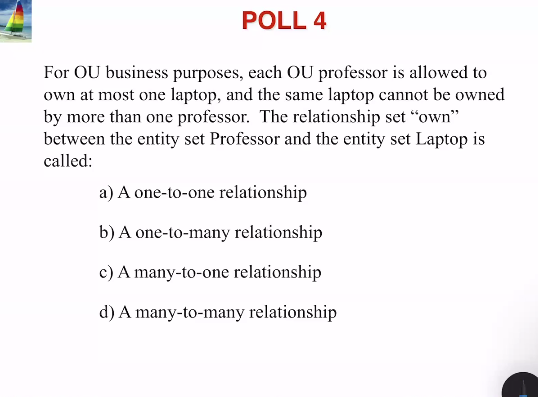
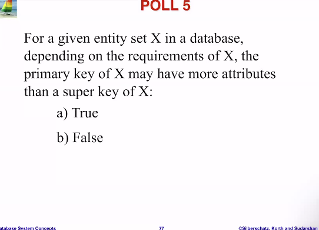
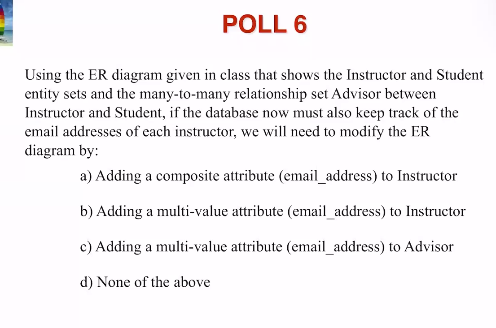
The ER Diagram represented in Poll 6:
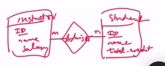
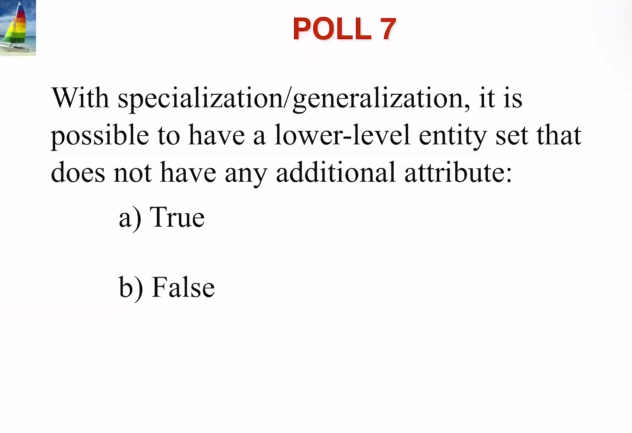
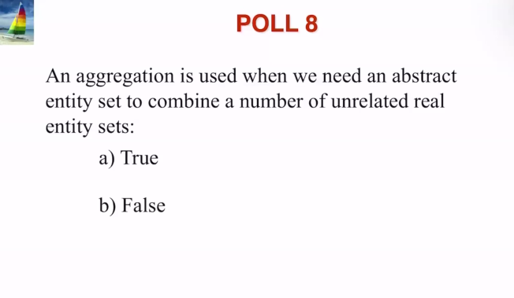

---

# Lecture 1

###### Topic 2: Entity-Relationship Model

---

- **Conceptual design**: After analyzing the requirements for our database—what we want to store and how those elements are related—we develop the ER Diagram.

  - The ER Diagram is not implemented directly in any system.
  - The ER Model has certain **limitations** that may prevent us from accurately representing all aspects of the database.

- **Logical schema**: Once we have the ER Diagram, we convert it into a logical schema by creating tables using SQL, tailored to the specific database management system (DBMS) we are using.

- **Functional analysis**: This involves examining the requirements for our queries, such as whether they are retrieving or joining data.
  - This analysis informs our decisions regarding the **physical design**, including considerations like whether to create indexes.

Sure! Here’s an improved version of your notes:

## ER Modeling

- **Entity**: A distinct object that can be identified separately from other objects.

  - **Example**: Person, department, company, test.

- **Attributes**: Properties or characteristics that describe an entity.

  - **Example**: A person has a name and age; a department has a name; a company has a name and annual profit; a test has a name and date.
  - **Domain**: the set of values the attribute is permitted to take on. this is decided based on application requirements.
  - **Ex**: In SQL, we define these with constraints. We may not want a GPA to be negative for a student entity, for instance.
  - **Simple Attribute**: is not divisible, has only one part.
  - **Composite Attribute**: composed of more than one part.
    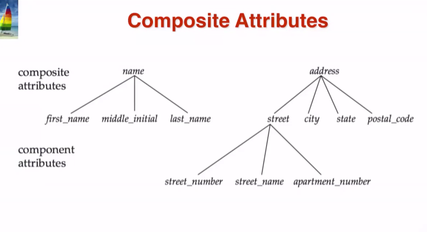
  - **Single-valued attribute**: has only one value
  - **Multi-valued attribute**: has multiple values

    - **Ex**: a student may have multiple values for phone numbers, called `phone_numbers`

    - **Derived attribute**: can be computed from other attributes
    - **Ex**: we may store `date_of_birth` which allows us to calculate `age`, the derived attribute

- **Entity Set**: A collection of all entities of the same type that share the same attributes.
  - **Example**: The set of all persons, the set of all departments, etc.

### Relationships

- **Relationship**: An association between two or more entities.

- **Relationship Set**: A collection of similar relationships that share common attributes.

- **Attributes of Relationships**: Relationships can possess their own attributes, which describe the relationship rather than the individual entities involved.

  - In SQL, relationships may be represented in separate tables, which include additional columns for these relationship attributes.  
    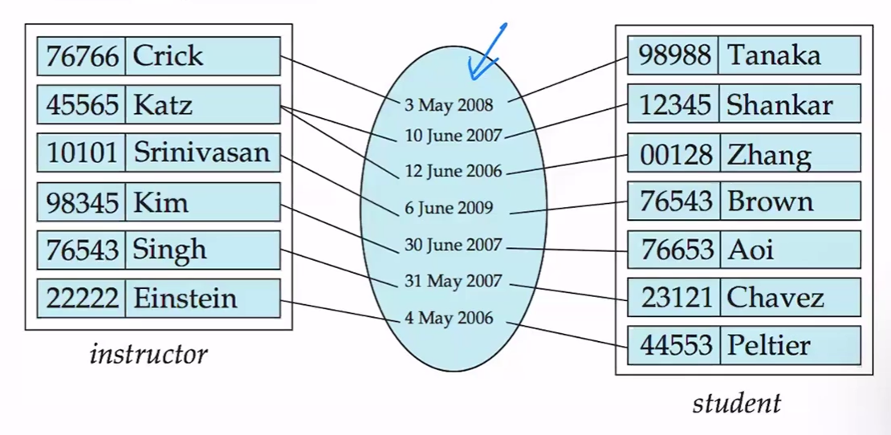  
    In this example, each instructor is associated with at least one student, and a date is linked to that relationship.

- **Degree of Relationship Set**: The number of entities involved in a relationship set.

  - **Binary Relationship**: Involves two entity sets and has a degree of `2`.
  - **Non-Binary Relationship**: Involves more than two entity sets and has a degree of `n > 2`.

- **Recursive-relationships**: A relationship between entities that are not distinct from eachother.

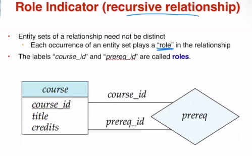

This is essentially what is happening:

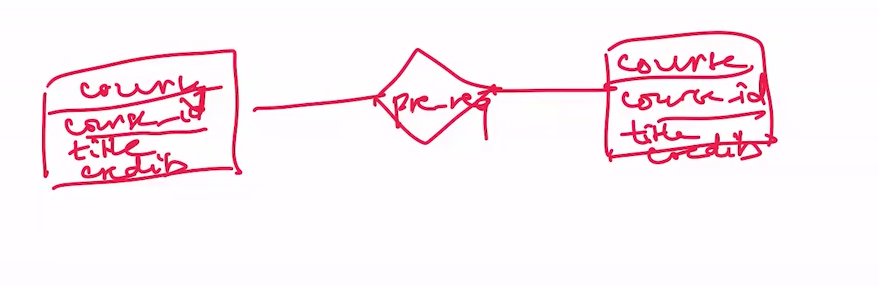

## Cardinality Constraints

### Types

- One-to-One
- One-to-Many
- Many-to-One
- Many-to-Many  
  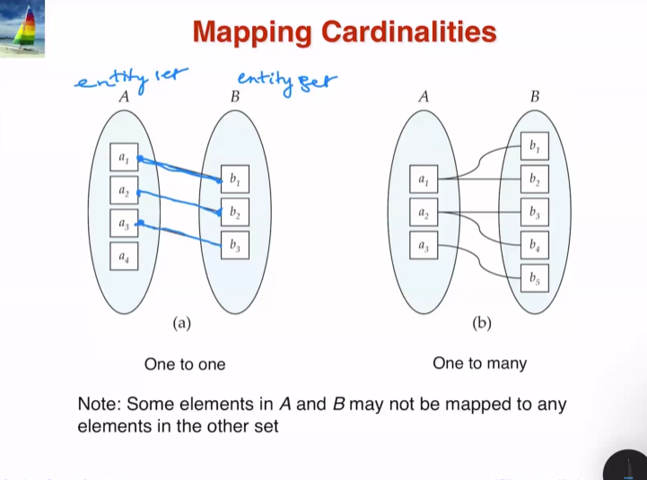

#### Caveats

These definitions differ from their mathematical counterparts. For example, in a one-to-one cardinality, an element of set A may not have a corresponding element in set B, even though a one-to-one relationship exists. This applies to all cardinality types.

## Keys <small>of an Entity Set</small>

- **Super Key**

  - Composed of one or more attributes.
  - These attributes collectively _uniquely identify_ an entity within the entity set.

- **Candidate Key**

  - A _minimal_ super key, meaning it contains the fewest number of attributes necessary to uniquely identify the entity.
  - **Example**: If `ID` is a super key, then adding attributes (e.g., `(ID, name)`, `(ID, salary)`) still results in super keys. However, these are not minimal because they contain more attributes than `ID`, which has only one. Therefore, `ID` is the _minimal super key_ (or candidate key).

- **Primary Key**
  - The candidate key that is _selected_ for identification purposes.
  - While multiple candidate keys may exist, only one can be designated as the primary key.

---

# Lecture 2

## Symbols used in ER Notation

Many of these symbols are described in this lecture, so I've included the key from the textbook here.

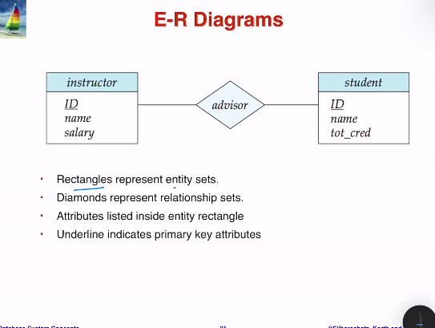
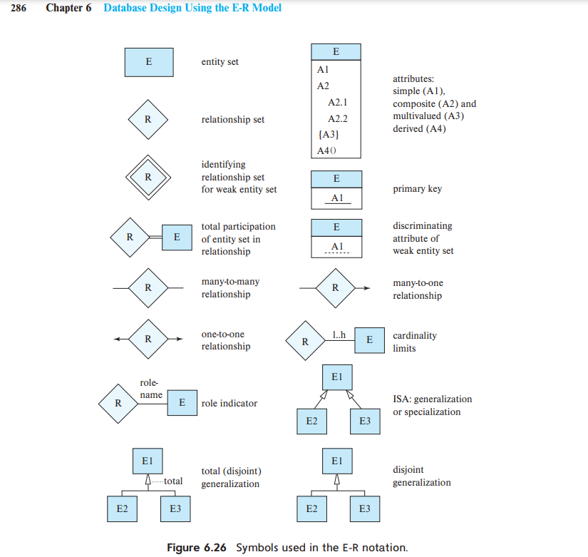

### Attribute Types

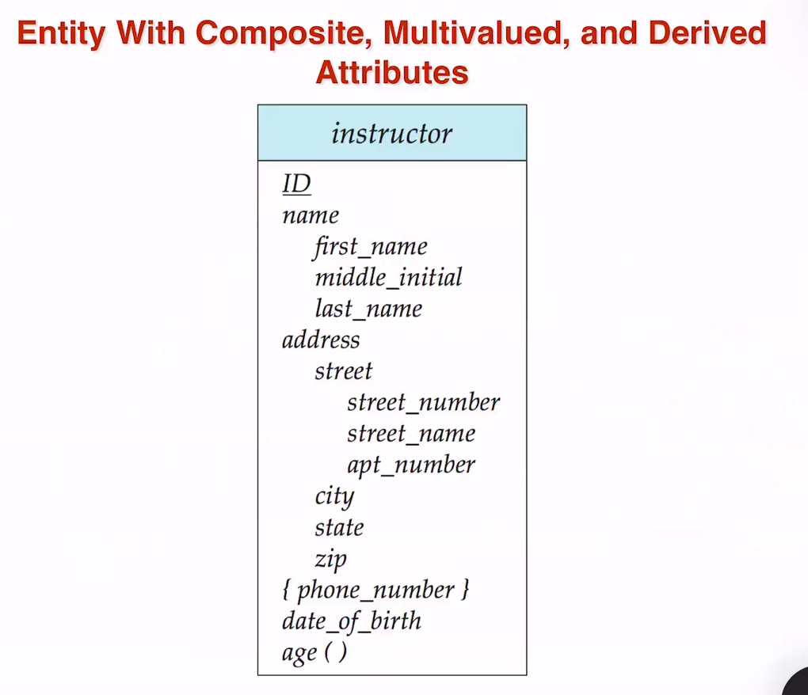

- The `name` attribute is a composite attribute, as indicated by the indented attributes beneath it, which include `first_name`, `middle_name`, and `last_name`.
- The `{phone_number}` attribute is multivalued, as denoted by `{}`, allowing for the storage of multiple phone numbers per instructor.
- The `age()` attribute is derived, indicated by `()`, likely calculated from the `date_of_birth`.

#### Simple Attributes

- `first_name`
- `middle_name`
- `last_name`
- `city`
- `zip`
- `state`
- `date_of_birth`

### Participation of an Entity in a Relationship Set

- **Total Participation** (Every, all)
  - Indicated by a double line.
  - A line without an arrowhead signifies a many-to-many relationship. A double line indicates total participation.
  - In the image below, an instructor can advise 0 or more students. However, the double line indicates that _every_ student must be advised by at least one advisor.
- **Partial Participation** (Some, 0 or more)
  - Indicated by a single line.
    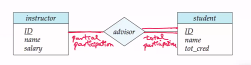

#### Notation for Complicated Constraints

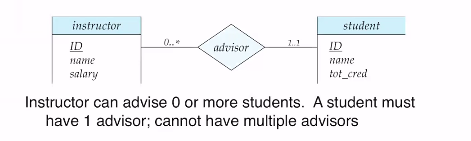

- `min..max` notation
- `*` denotes no limit.
- A minimum value of 1 signifies total participation.
- A maximum value of 1 indicates that the entity participates in at most one relationship.
- A maximum value of `*` denotes no upper limit.

#### Ternary Relationships

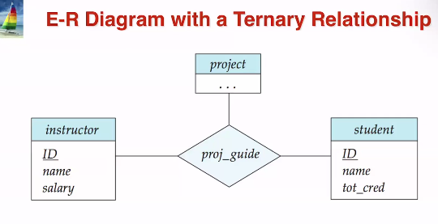

#### Example

- This relationship connects students, projects, and instructors, thereby linking all three entities.
- Thus, whenever the `proj_guide` relationship exists, these three entities must also coexist.

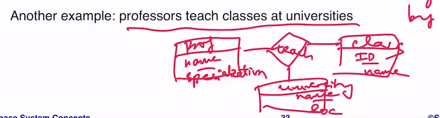

- "Professors teach classes at universities."
- We have three entities: professors, classes, and universities.
- They share the "teach" relationship with each other—a clear indicator of this is the verb _teach_.
- This necessitates the creation of a ternary relationship among them.

## Weak Entity Sets

- **Definition**: Occurs when an entity set lacks a primary key derived from its _own_ attributes.
- The existence of this entity set _depends on_ the existence of another set, referred to as the **identifying entity set**.

- The strong entity set in this image is the _course_ entity set.
  - This is indicated by its primary key, `course_id`.
- The weak entity set is the section, as multiple sections can share the same `sec_id`, `semester`, and `year`.
  - The identifying entity set is the `course` related to each section, indicated by the double diamond around `sec_course`.
  - If we know the `course_id` of the related `course`, we can distinguish between different sections.
  - The dotted line indicates the `descriminator(s)` that help differentiate sections within the same weak entity set. However, to distinguish them uniquely, we require the strong entity set.

---

# Lecture 3

<small> I omitted the section on design issues. Practice the homework to review this topic; notes may not be particularly beneficial. </small>

## Extended ER Features

### Specialization (Top-down) and Generalization (Bottom-up)

These processes occur when an entity set has designated sub-entity sets ("subgroupings") that inherit attributes and relationship participation from their parent entity sets.

- **Specialization**: A design approach that starts at the top level and creates sub-entity sets that inherit from the parent.
- **Generalization**: A design approach that starts at the bottom level, merging entity sets to create higher-level entity sets that share common attributes.
- Specialization and generalization are often used interchangeably, as both processes yield similar outcomes.

- **Attribute Inheritance**: A lower-level entity set inherits all attributes and relationship participation from the higher-level entity set to which it is connected.
  - This is analogous to class inheritance in OOP.
  - Represented by a hollow arrow pointing toward the entity.

#### Example

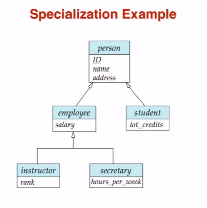

- A person can be both an employee and a student (**overlapping**).
- An instructor can be either an employee _or_ a secretary, but not both (**disjoint**).
  - Indicated by the arrow that diverges.
- An employee is a person; an instructor is an employee, so an instructor is also a person.
- An employee is a person; a secretary is an employee, so a secretary is also a person.
- Instructor attributes include: `rank`, `salary`, `name`, `address`, `ID`.
- Secretary attributes include: `hours_per_week`, `salary`, `name`, `address`, `ID`.
- Employee attributes include: `salary`, `name`, `address`, `ID`, and so on.

### Aggregation

#### Motivation

What we want: when a student is working on a project guided by an instructor, we wish to record information about that guidance in the evaluation set, meaning the instructor is evaluating the student.
Problem: In the ER model, a relationship cannot connect directly to another relationship, which would violate the ER model.

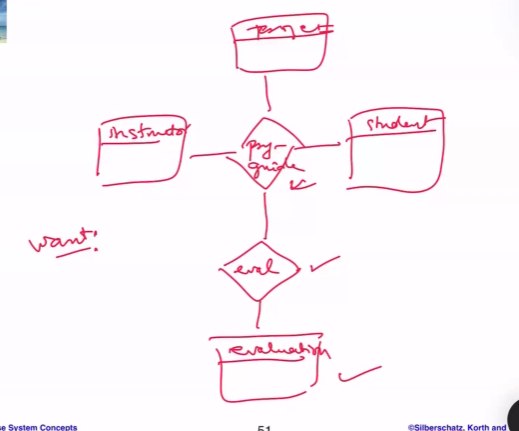

#### Solution: New Notation

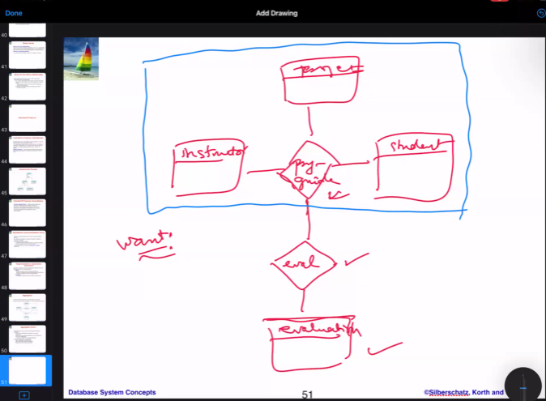

The blue rectangle surrounding the entity sets is not a true entity set; it is merely abstract. We can assert that the combination of these sets is permissible.
This notation expresses a relationship among relationships.

### Alternative ER Notation

These were briefly discussed, but we were advised against using them in homework or exams. They are likely not useful for review.

---

# Lecture 4

This entire lecture focused on working through two examples. For brevity, I won’t be posting the solutions here. I encourage you to work them out on your own for effective practice. Be sure to tackle the practice problems and revisit the homework questions as well.

---
