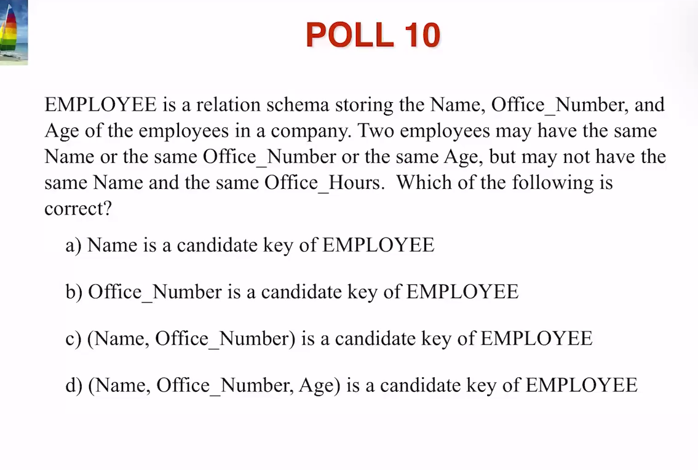
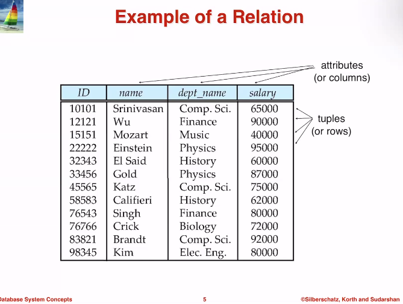
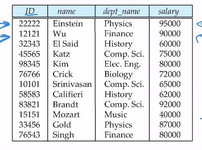
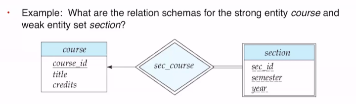
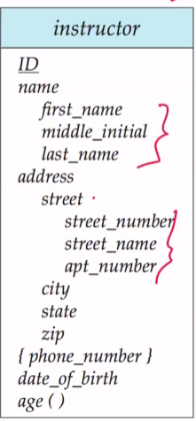
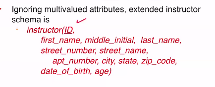
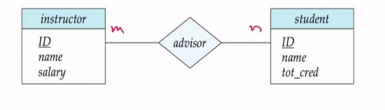
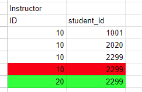
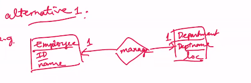

## Topic 3 Polls

---

# Lecture 1

###### Topic 3: Relational Data Model

---

This table illustrates the relational data model, where each row is a tuple of its columns, `(ID, name, dept_name, salary)`. A limitation of the relational model is that it doesn’t readily depict relationships between tables, making it less expressive than an ER diagram.

## Attribute Types

- **Domain**: The set of permitted values for each attribute, also present in the ER model.
- **Atomic**: An atomic attribute cannot be divided further; most attributes must be atomic.
- **Null**: Null is a special value and is always part of every domain, which can complicate operations like joining and selecting.

## Relation Schema and Instances

A **relation** is defined as: R(A_1, A_2, ..., A_n), where A_1, A_2, ..., A_n are attributes of an entity set.

**Example**: `student(ID, name, major, GPA)`, where `student` is R and its attributes are `ID`, `name`, `major`, and `GPA`.

**Relation instance**: A snapshot in time or an instance of a relation.

- **Example**: For the `student` relation, instances may include `student(0, Parker, Comp Sci, 5.0)` and `student(1, Jorge, Graphic Design, 7.0)`.

### Properties

- Tuples are formally unordered. When a tuple is inserted, the DBMS determines its order.

This example shows that there is no clear ordering of the rows (tuples) in the table.

## Keys

This section was reviewed from Topic 2.

## Converting ER Diagrams to Relation Schemas

To convert an ER diagram to a relational model, we create a set of relation schemas, which can be implemented as tables in a DBMS.

### Converting Entity Sets with Simple Attributes

- A strong entity set becomes a schema with identical attributes.
- A weak entity set includes its attributes plus the primary key of the strong identifying entity set.

**Answers**:

1. For `course`: course(<u>course_id</u>, title, credits)
2. For `section`: As a weak entity set, its schema is section(<u>course_id</u>, <u>sec_id</u>, <u>semester</u>, <u>year</u>), with no dotted line and underlined discriminators.

### Composite and Multivalued Attributes

Multivalued attributes require multiple relation schemas, unlike simple attributes, which convert directly.

#### Example

##### Relation schema without considering multivalued attributes

- The `name` attribute is omitted, and only attributes of the composite attribute are stored. The same applies to `street`.
- In the relational model, we lose the connection between sub-attributes and their composite attributes, which is clear in the ER model.
- To resolve ambiguity with similarly named sub-attributes, prefixes are added: instructor(<u>ID</u>, name_first_name, name_middle_name, name_last_name, ...).

##### Relation schema considering multivalued attributes

A second schema/tuple is created for multivalued attributes. The ID associates phone numbers with instructors, and both are keys since one instructor can have multiple phone numbers.

**Answer**: phone_number(<u>ID</u>, <u>phone_number</u>)

### Converting Relationship Sets

#### Many to Many

- Convert one entity set at a time, followed by the relationship.

**Answer**: instructor(<u>ID</u>, name, salary), student(<u>ID</u>, name, total_cred), advisor(<u>instructor_ID</u>, <u>student_ID</u>).

- Both keys are necessary due to the many-to-many relationship, which requires unique identification through two primary keys.

An instructor can advise multiple students, and a student can have multiple advisors, but the same instructor cannot advise the same student more than once.

<snmall> This is depicted in this table. </small>
<snmall> Red means it is not permitted with the relational model, green means it would be okay. </small>

#### One to One

##### Example 1: Normal 1-to-1

Employee has an ID and name.
Department has a dept_name and location (loc).
Employees have a one to one relatonship with department, manage.

Answer:

employee(<u>ID</u>, name)
department(<u>dept_name</u>, loc)

1. Create a new relation schema containing both primary keys of employee and department.
2. Choose only one of these keys to use as the primary key for the schema.

manage(<u>ID</u>, dept_name)
manage(ID, <u>dept_name</u>)

Both solutions accomplish the task, however the best solution is the one with the shorter key. So, manage(<u>ID</u>, dept_name) is the best solution.

##### Example 2: Total Participation (One Entity Set)

From topic 2, total participation means that at _every_ department must be managed by _at least one_ employee. This is indicated by the double line.

1. If only one of the entity sets have total participation,
2. Create 2 relation schemas, one for each entity set
3. Then include the relation in the entity set with the total relation.

Answer:

employee(<u>ID</u>, name)
department(<u>dept_name</u>, loc, employee_ID)

##### Example 3: Total Participation (Both Entity Sets)

1. If both the entity sets have total participation,
2. Create 1 relation schema, for either of the entity sets
3. Then include the relation in the entity set with the total relation.

Solution:

employee_department(<u>ID</u>, name, dept_name, loc)
employee_department(ID, name, <u>dept_name</u>, loc)

The better of the two solutions is employee_department(<u>ID</u>, name, dept_name, loc), because `ID` is shorter than `dept_name`.

#### One-to-Many and Many-to-One

##### Example 1

1. Create a relation schema for the relationship
2. Put the key of the many-side entity set into that relation schema

Solution:

employee(<u>ID</u>, name)
department(<u>department_name</u>, loc)
works_for(<u>ID</u>, department_name)

#### Example 2

Don't create an extra relation schema.

1. Create the relation schema for both entity sets
2. Store the relationship in the many-side entity set.

employee(<u>ID</u>, name, dept_name)
department(<u>department_name</u>, loc)

### Converting Relationship-Sets that have Attributes
