## Topic 4 Polls

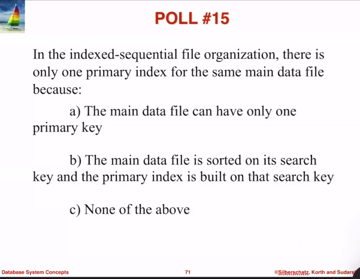
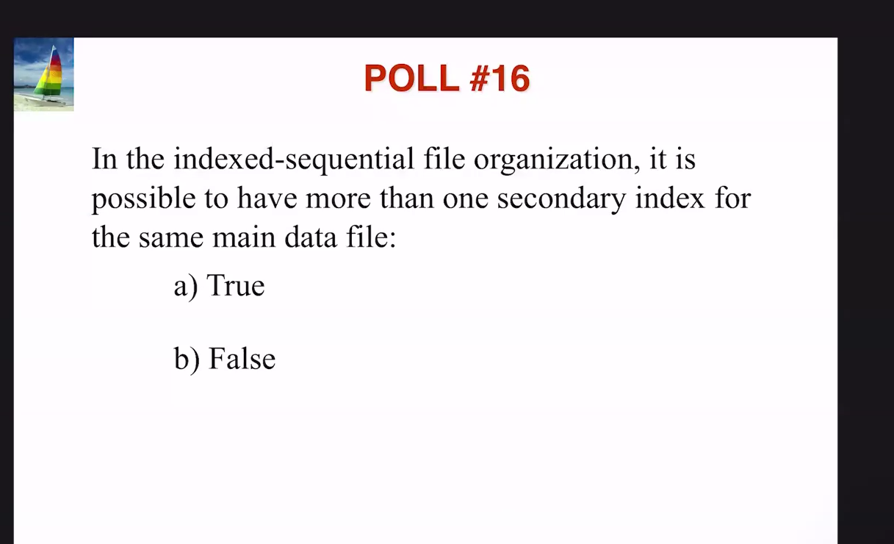

###### Topic 4: Indexing

---

# Topic 4

## Record Representation in File

- A record is a sequence of fields (attributes).

### Approach One: Fixed-Size Records

- Assumes a fixed record size.
- Each file contains records of a single type.
- Each relation corresponds to a separate file.

#### Example / Explanation

In this approach, the file size is fixed. For instance, for the `name` column defined as `name char(40)`, every name will occupy 40 characters, even if the name is "Wu," which has only 2 characters.

##### Deleting Records

###### Shifts

- Deleting a record not at the end requires shifting subsequent records, potentially causing millions of shifts.

###### Replacement

- Some systems use a replacement method where the last record is moved to fill the gap when a record is deleted.

##### Free List Method

1. Store the first deleted record’s address in the file header.
2. Each deleted record points to the next, creating a linked list.
3. Insertions can follow this list to find the first available position.

This method efficiently reuses space.

#### Approach Two: Variable-Length Records

- Used for storing multiple record types in one file.
- Supports variable lengths for fields (e.g., `varchar`) and repeated fields (e.g., arrays).
- Null values are represented by a bitmap.

##### Record Representation for Easy Retrieval

- It takes 5 bytes for 5 digits and 10 bytes for a name of 10 characters.

##### DBMS Data Access

The DBMS knows where to access data based on the byte string. For example, in a query like:

```sql
SELECT name
FROM instructor
WHERE salary > 1000
```

The first three fields of the byte string indicate where the information is stored.

##### Null Bitmap

Each bit in the bitmap indicates whether a field is null (1) or not (0). For example, for an instructor with an ID of 10101 and a salary of 65000, the bitmap could be `0000`, indicating all fields are not null.

## Heap Files (Pile Files)

- The file is unordered and unsorted.
- The records are related to eachother.
- File size is limited by the size of memory and storage medium

### Operations

Access is performed via sequential methods.

- **Delete from Anywhere**

  - The file must be periodically shrunk to reclaim unused storage.
  - Average access requires (#pages/2) + 1 if the row exists; #pages if it does not.

- **Insert at End**

  - Average access requires (#pages/2) if the row already exists; #pages + 1 if it does not. efficient because no sorting.

- **Query (Select)**
  - For queries that return all rows, such as `SELECT * FROM Table`, access is efficient since order does not matter.
  - More specific queries, like `SELECT * FROM Table WHERE xyz=true`, are inefficient.
  - General access becomes inefficient when only a subset of rows is requested.

### Sequential File Organization

- Files are stored in a sequential manner, in ascending or descending order.z
- This is determined by the **key field**
- Search starts from the beginning of the file, records are added at the end of the file.
- You cannot add a record in the middle of a file without overwriting another file. That is, there are no empty spaces allowed.

#### Operations

- Sorting
  1. place the new record at the end
  2. sort the sequence in either ascending or descending order
  3. sortion order is based on the given key field. it can be any attribute of the record. _in homework 3, problem 3, gq4, we used days_in_hospital to sort the records, instead of primary keys_.

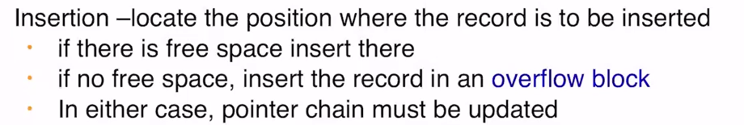

#### Disadvantages

- random searching is not possible. we always have to start at the beginning of the file
- sorting method is inefficient, high space and time complexity

### Index-Sequential File Organization

- Stored in two file types (two that we've already discussed)
  1. the Main data file: a sequential file that stores complete tuples stored by a search key
  2. the index file

#### Secondary Index (using unique secondary-key)

- is candidate key
- based on a non-ordering attribute/field
- this allows us to build another index for a query on a different attribute
- just like the first index file, this one will need a pointer to a main data file and some values of the secondary key for comparison.
- gets sorted
- this is dense, meaning all unique values are considered in the index.

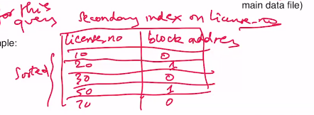

#### Secondary index using non-unique secondary-key

We now need buckets because the values can be repeating in the address.

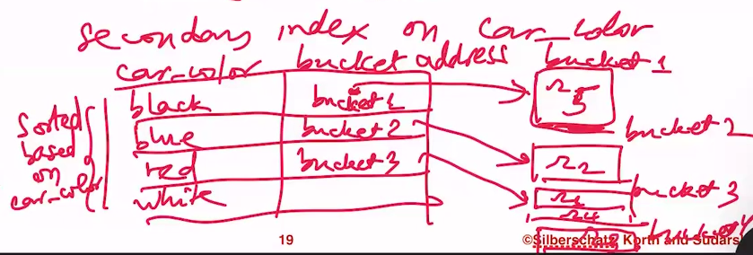

Each bucket points to a row with the value in it.
The bucket address can only store one address, so we make it point towards a bucket, which can contain multiple address. Thus, if "red" appears multiple times, then there wll be multiple rows in the bucket associated with red. That is so we can find every occurence of "red" very quickly.

#### Example

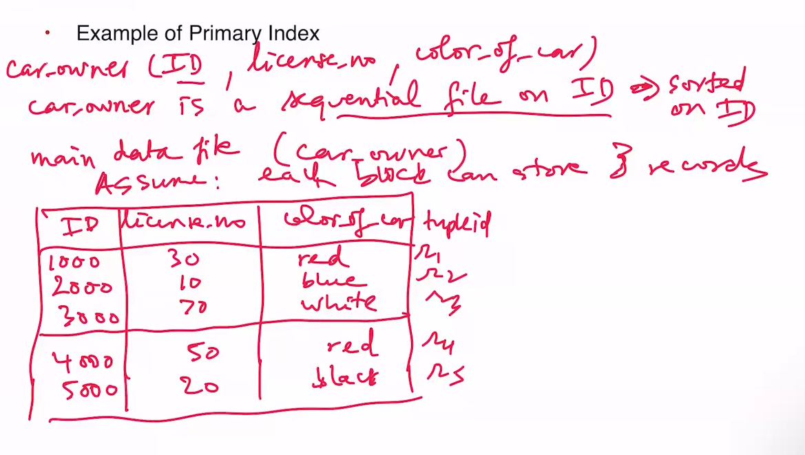

Since each block can store 3 records, `Block 0` has the records of row1, row2, and row3.
`Block 1` has the records of row4 and row5.

#### Building Index file

##### Sparse index

Create a table that contains the search ID in one column and the block address of the first row of each block. For instance,

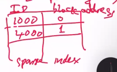

This is sparse because only the first of each block is stored.
When each index is used, it is loaded by itself in main memory. This makes it very fast.
Each search in the block is still a linear search, but if we are using a WHERE or something on the search key used in the index, it can be very fast.

##### Dense Index

This is dense because every unique search entry is stored.

### B Trees and B+ Trees

#### B+ Trees

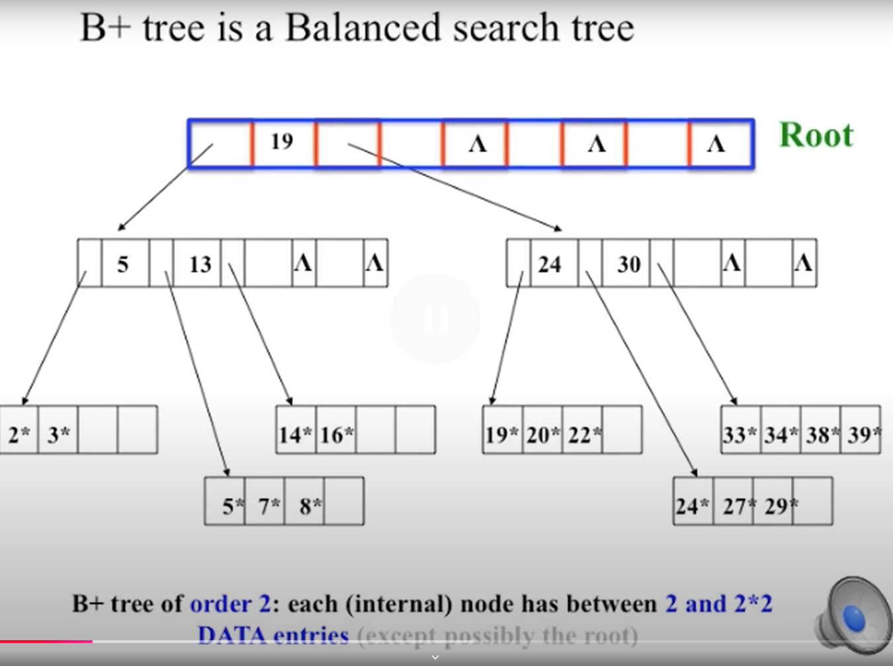

##### Searching

Similar to binary search but follows an edge to lookup values at the leaves.
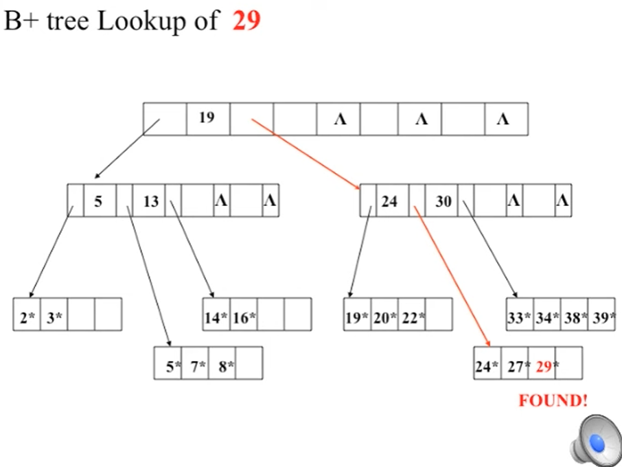

##### Insertion

1. use the lookup procedure
2. if there is space, insert the value into the sorted position

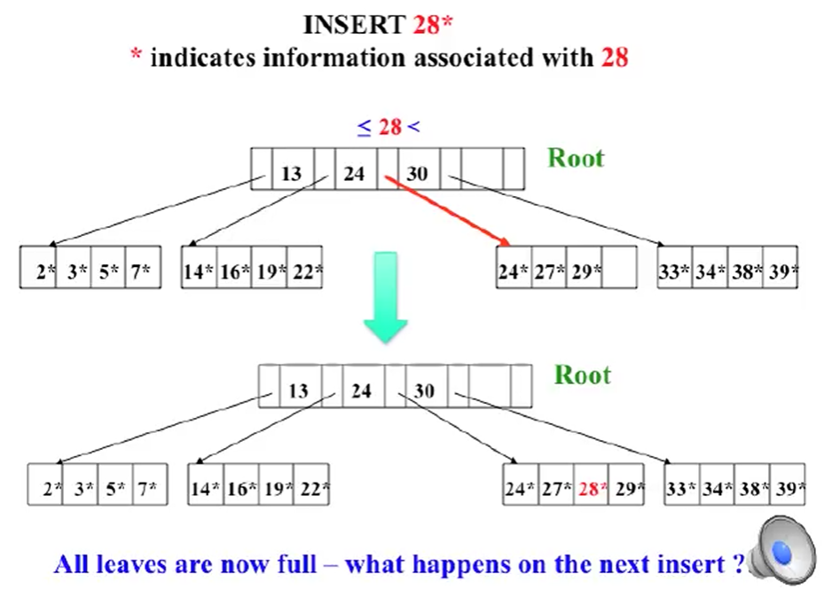

3. if it is full, split the leaf where it wouldve gone, creating two leaves.
4. split the left leaf with all values less than the inserted value
5. split the right leaf with all values greater than the inserted value.
6. then, push 19 up to the root leaf if there is room. this will point to the newly created leaves.

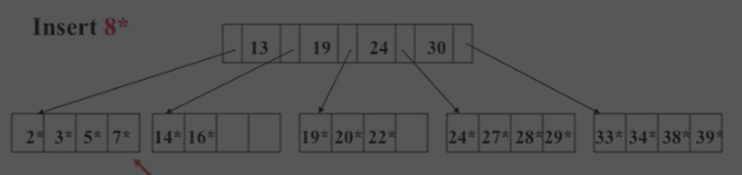

7. what if the root is full?

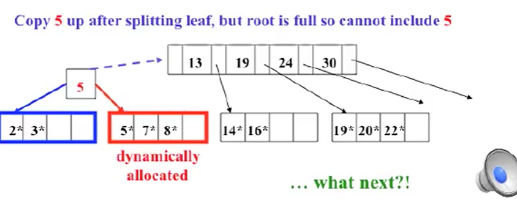

###### Exercise:

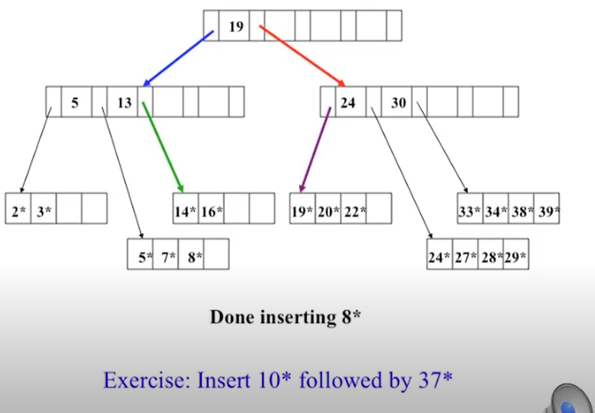
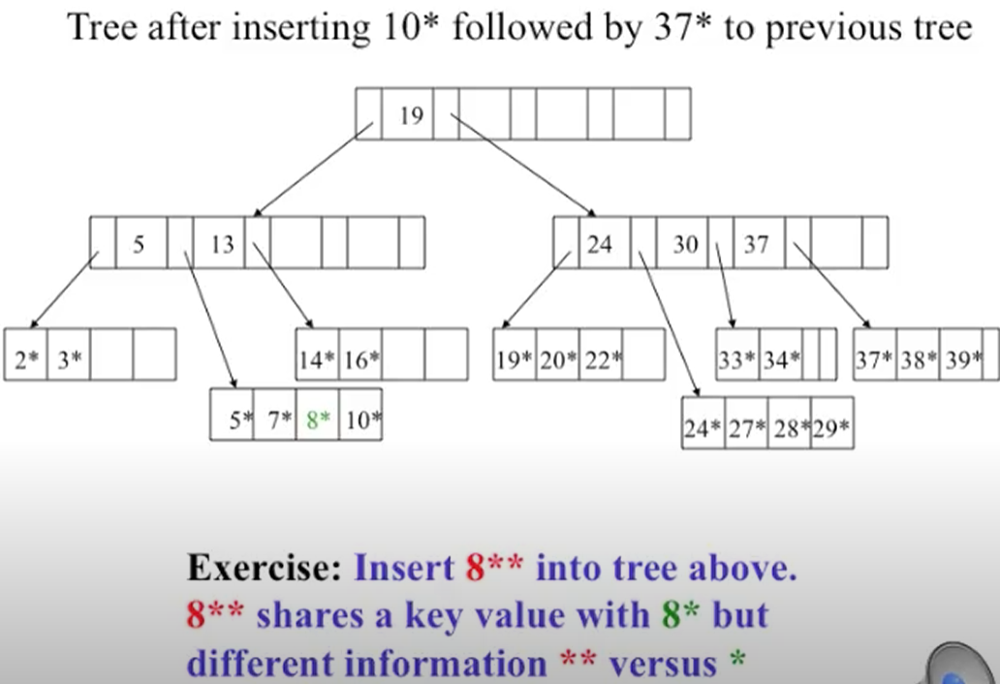

### B Trees

Equations:
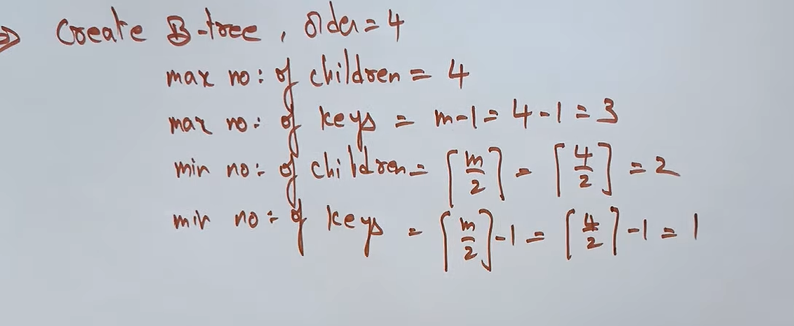

#### ERD Trees

### Static Hashing

### Extendable Hashing

### Data Dictionary Storage
