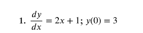

# Section 1.2

## Notes

We are studying first order differential equations in the form
$ \frac{dy}{dx} = f(x) $

Since the right hand side does not depend on y, we can solve these equations by taking the antiderivative of both sides.

This will leave us with 

$$ \int \frac{dy}{dx} \, dx = \int f(x) \, dx \implies y(x) = F(x) + C $

This equation encompasses a family of solutions for the differential equation $ \frac{dy}{dx} = f(x) $. Each of these solutions differs only by the arbitrary constant C.

In order to find a particular solution, i.e. figuring out what C is, we'll need to know an initial condition of the function $ y(x) $.

For instance, we may have some function $ \frac{dy}{dx} = f(x) $ with initial condition $ y(0) = 3 $.

## Verifying Solutions

### General Solutions

In order to verify the general equation, we simply take the derivative of both sides.

$$ \frac{d}{dx} (y(x)) = \frac{d}{dx} (F(x) + C) $$

If we obtain $ \frac{dy}{dx} = f(x) $, then we can be sure our general solution is correct.

### Particular Solutions

However, this is not enough to verify the correctness of particular solutions.

This is because the derivative of a constant is 0.
Thus, every derivative of the family of general solutions will become $ \frac{dy}{dx} = f(x) $.

In order to show that a particular solution is correct, we must verify it by using the initial condition.

So, we plug in the C we found into the general solution. 
Then, we plug in the initial x. If the result is the initial y, we have confirmed our solution.

That is, $ y(x_0) = F(x_0) + C = y_0 $

## Examples

### Homework 

The general solution to this diff-eq is $ y(x) = x^2 + x + C $.
The particular solution, which satisfies the initial condition, is $ y(x) = x^2 + x + 3 $.

#### Lunar Lander

#### Physics Applications
