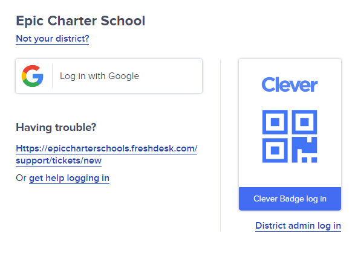

# Helpful Resources

## Tools

Here are some tools you can use for homework:

1. [Scientific Calculator - _Desmos_](https://www.desmos.com/scientific)
2. [Graphing Calculator - _Desmos_](https://www.desmos.com/calculator)
3. [Presentation Software - _Google Slides_](https://docs.google.com/presentation/u/0/)
4. [Spreadsheet Software - _Google Sheets_](https://docs.google.com/spreadsheets/u/0/?pli=1)
5. [Free Storage - _Google Drive_](https://drive.google.com/drive/home)

## Studying

- [Create Flashcards - _Quizlet_](https://quizlet.com/gb)

## History

- [Fun History Videos - _CrashCourse on YouTube_](https://www.youtube.com/@crashcourse)

## Math Help

1. [Easy Math Explanations - _Math Is Fun_](https://www.mathsisfun.com/)
2. [Math Help - _Khan Academy_](https://www.khanacademy.org/)
   - Make an account and choose your class (like **Algebra 2** or **Geometry**). You’ll find many **video tutorials** and practice exercises for **free**.

## Fun Learning Tools

1. [Explore the World - _Google Earth_](https://earth.google.com/web/@0,-0.1795,0a,22251752.77375655d,35y,0h,0t,0r/data=CgRCAggBOgMKATBKDQj___________8BEAA)
2. [View the Solar System - _NASA_](https://eyes.nasa.gov/apps/solar-system/#/home)
3. [Practice Math Games - _CoolMathGames_](https://www.coolmathgames.com/0-crazy-taxi-m12)

# Access Clever from Any Computer

1. Go to [Clever](https://clever.com/oauth/authorize?channel=clever&client_id=4c63c1cf623dce82caac&confirmed=true&district_id=520a6793a9dd788a46000fdc&redirect_uri=https%3A%2F%2Fclever.com%2Fin%2Fauth_callback&response_type=code&state=c51594fd3a8cfacd4d603a147c7e799fd3ea11fcb7b2b83927915406accfe01a) using this link.
2. Click on the _Gmail_ login button.
   
3. Enter your login details.
4. You’re all set!

# Tips for Effective Learning

1. Always try your best before asking for help.
2. If you're stuck and have tried hard, it’s okay to ask for help.
3. If you don’t understand a word, look it up! First, try to guess what it means. This helps you remember it better.
4. For math, try to figure it out yourself first. If you still can’t, ask your teacher or me for help.
5. Take breaks when you feel tired. A 15-minute break can help you focus better.
6. Keep your space quiet. Turn off your phone and find a calm spot to study. Ask your teacher if you can use a quieter room in the library.

### Always remember...

**Never give up!!!** You can do anything. Don't limit yourself!

-Parker
