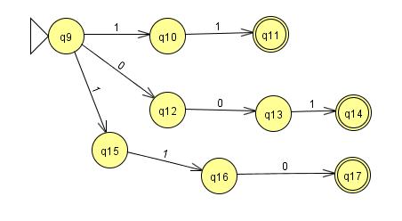
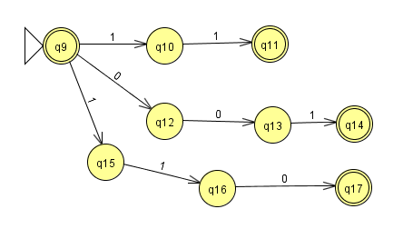
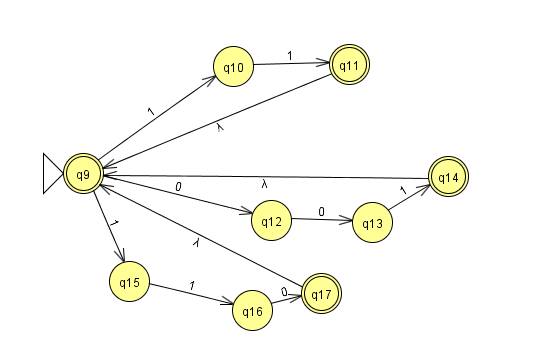

# Homework 3 Notes

## NFA for Regular Expression with Kleene Star \(\star\)

1. **Create NFAs for Each Substring**  
   Start by creating NFAs that accept each substring from the language, all sharing the same start state. For example, for the regular expression \(R = (00 + 001 + 110)\star\), we can break it down into three NFAs:
   - One NFA for the substring "00"
   - One NFA for the substring "001"
   - One NFA for the substring "110"

   

   With these NFAs, we’ve covered the regular expression \((00 + 001 + 110)\).

2. **Make the Start State an Accept State**  
   Change the start state to also be an accept state. This allows the NFA to accept the empty string \(\lambda\).

   

3. **Add \(\lambda\) Transitions**  
   From each accept state, connect back to the start state using a \(\lambda\) transition. This is important because our language allows any combination of the substrings "00", "001", and "110". The NFA was designed to accept only these specific substrings. After processing one substring, if there’s input left, we can start processing it again. 

   If the leftover input doesn’t consist solely of "00", "001", or "110", the NFA will reject it. To illustrate, consider the string "0001": it can be broken down into "00", leaving "01" behind. Since no part of "01" contains an accepted substring, we reject it.

   

## Finite State Transducer (FST)  
### Extended Definition  

[Finite State Transducers](https://en.wikipedia.org/wiki/Finite-state_transducer) (FSTs) are intriguing because they are "more general" than Deterministic Finite Automata (DFAs). While DFAs and NFAs filter inputs into "accepting" or "rejecting" categories, FSTs map input strings to output strings. This ability to transform data makes FSTs particularly useful for language parsing and translation.

For instance, imagine you have a set of characters \(\{0, 1\}\). An FST could map different combinations of these characters to an output set, like \(\{a, b, c, \ldots, z\}\) or \(\{\sigma, \omega, \alpha\}\). In this way, FSTs create relationships between one set of strings and another, effectively transforming inputs rather than just accepting or rejecting them.

Overall, understanding how FSTs parse strings and produce outputs isn't overly complicated, and this basic knowledge may be all you need.

## Forming regular grammars algorithmically
